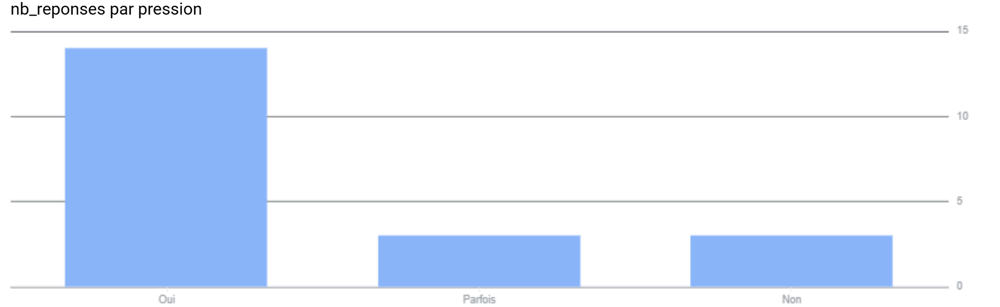

# Analyse des pratiques d’attente dans le RER D

Projet réalisé dans le cadre d’un pré-mémoire de L3 sociologie  
Université d’Évry Paris-Saclay (2025–2026)

---

## Problématique

En quoi les comportements et les pratiques des usagers des transports en commun durant l’attente illustrent-ils l’accélération sociale et ses conséquences dans la société contemporaine ?

---

## Principaux enseignements

L’analyse exploratoire met en évidence plusieurs tendances concernant la perception du temps dans les transports :

- 88 % des répondants déclarent ressentir au moins parfois une pression temporelle.
- Les usagers voyageant en heure de pointe déclarent plus souvent ressentir une pression liée au temps.
- L’usage du smartphone apparaît comme une stratégie dominante pour occuper les moments d’attente.
- Ces observations sont cohérentes avec la théorie de l’accélération sociale développée par Hartmut Rosa.

Les résultats doivent être interprétés comme **exploratoires**, car ils reposent sur un échantillon limité (25 répondants).

Le questionnaire constitue une **étude pilote**, visant à tester une méthodologie d’analyse des pratiques d’attente dans les transports et à identifier des tendances initiales concernant la perception de la pression temporelle.

---

## Méthodologie

Approche mixte combinant :

- observations ethnographiques dans les gares et les trains du RER D
- entretiens semi-directifs avec des usagers
- questionnaire exploratoire (25 répondants)
- analyse exploratoire de données avec SQL (Google BigQuery)

---

## Visualisations

### Distribution de la pression temporelle

### Relation entre heure de pointe et pression temporelle

---

## Compétences techniques mobilisées

- SQL (Google BigQuery)
- Analyse exploratoire de données (EDA)
- Création de variables analytiques
- Construction de tableaux croisés
- Visualisation de données
- Interprétation sociologique des données

---

## Structure du projet

- data/ → données brutes anonymisées
- sql/ → requêtes d’analyse
- visualizations/ → graphiques
- ANALYSE.md → analyse détaillée
- README.md → présentation du projet

---

## Analyse détaillée

L’analyse complète du projet est disponible ici :

➡️ **[ANALYSE.md](ANALYSE.md)**
